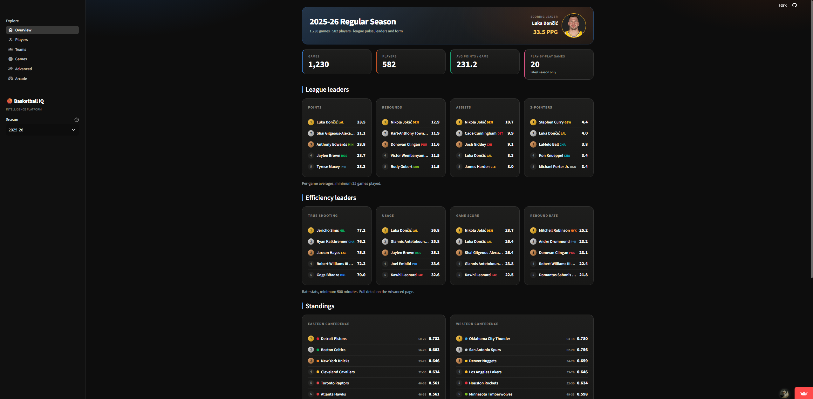
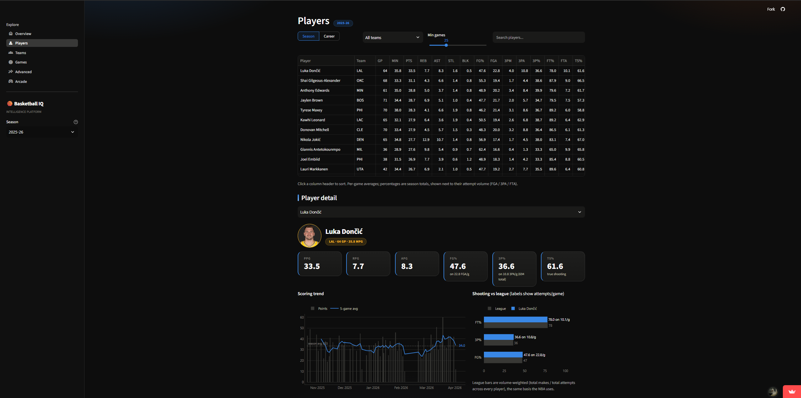
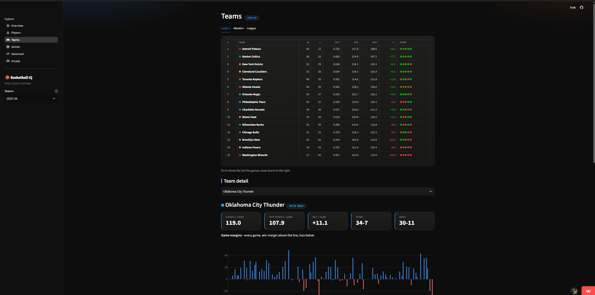
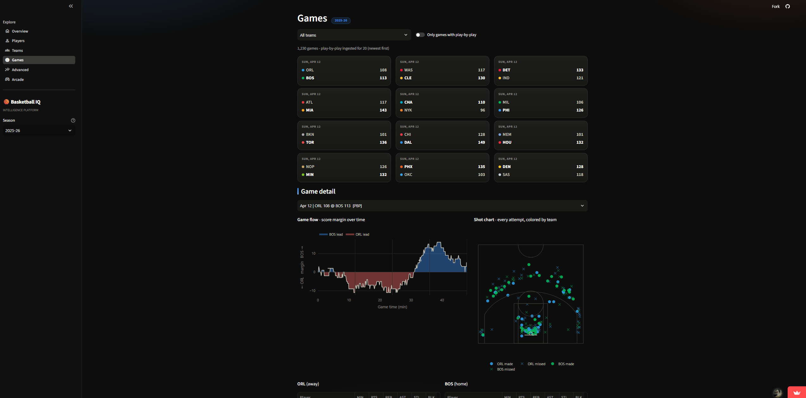
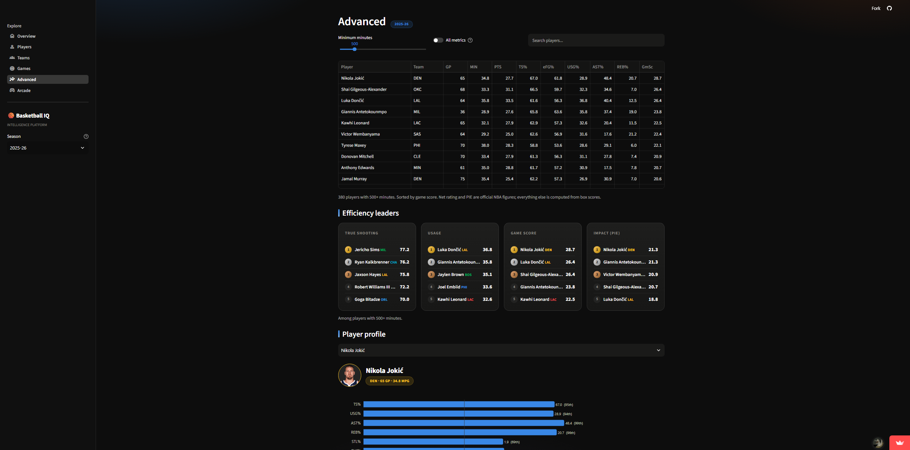
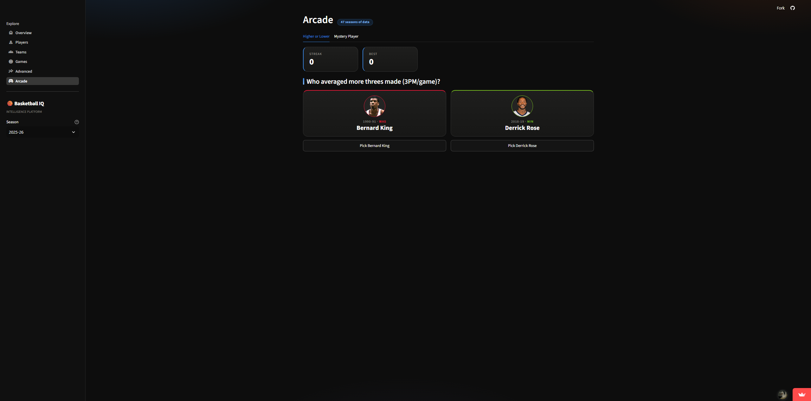

# Basketball Intelligence Platform 🏀

**Live dashboard:** https://basketball-intelligence-platform.streamlit.app

A local-first NBA data platform: ingest official NBA stats, warehouse them in
DuckDB, model them with dbt, and serve a public dashboard covering players,
teams, games, and advanced stats across 47 seasons of NBA history.
Natural-language Q&A and contract/salary data are not built; see
Status / roadmap below.

## Screenshots

**Overview** - KPIs, league and efficiency leaders, conference standings


**Players** - season stats table; player detail with scoring trend and
shooting-vs-league comparison


**Teams** - standings with last-5 form; team detail with a per-game margin
chart


**Games** - game detail with a score-margin flow chart and shot chart


**Advanced** - efficiency leaderboards and a per-player percentile profile


**Arcade** - Higher or Lower, one of two games built on the full season
history


## Architecture

```
stats.nba.com (via nba_api)
        |  rate-limited ingestion
        v
data/raw/*.parquet                 immutable raw extracts
        |  scripts/load_to_duckdb.py
        v
warehouse/basketball.duckdb        local DuckDB warehouse
        |  raw schema (API mirrors)
        v
dbt (dbt-duckdb)
        - staging       clean, rename, type raw tables (views)     [built]
        - marts         player and team season advanced metrics    [built]
        v
dashboard/ (Streamlit + Plotly)    dark FotMob-style stats app      [built]
```

## Data source

All data comes from the **unofficial stats.nba.com API** via the
[`nba_api`](https://github.com/swar/nba_api) Python package:

| Dataset | Endpoint | Grain | API calls |
|---|---|---|---|
| Player box scores | `LeagueGameLog` (player mode) | player × game | 1 per season |
| Team box scores | `LeagueGameLog` (team mode) | team × game | 1 per season |
| Play-by-play | `PlayByPlayV3` | event | **1 per game** |
| Player index | `CommonAllPlayers` | player (all-time) | 1 |
| Teams | `nba_api` static data | franchise | 0 |
| Player advanced stats | `LeagueDashPlayerStats` (Advanced) | player x season | 1 per season |

Net rating and PIE are the NBA's own official advanced stats (the
`LeagueDashPlayerStats` endpoint, Advanced measure type), available from
1996-97 onward. Earlier seasons derive the equivalent rate stats from box
scores instead - see `stg_player_advanced.sql` and `mart_player_season.sql`
for the exact cutoffs.

Because the API is unofficial and throttles aggressive clients, every request
goes through a rate limiter (≥1.5s between calls) with exponential-backoff
retries. Play-by-play is the expensive dataset (~1,300 calls for a full
season), so by default only the 20 most recent games are pulled; increase with
`--pbp-games N` or pull everything with `--all-pbp`.

Contract/salary data is **not** available from nba_api and will need a
separate source in a future session.

## Project layout

```
ingestion/nba_ingest.py        # pull NBA data into data/raw/*.parquet
scripts/load_to_duckdb.py      # data/raw into warehouse/basketball.duckdb (raw schema)
warehouse/                     # DuckDB database file (gitignored)
dbt/basketball_intelligence/   # dbt project (staging / intermediate / marts)
dashboard/app.py               # Streamlit app entry point
dashboard/lib/                 # db access, design tokens, plotly chart builders
dashboard/views/               # Overview / Players / Teams / Games / Dev Lab pages
data/raw/                      # raw parquet extracts (gitignored)
```

## Dashboard

`streamlit run dashboard/app.py` gives you a dark, FotMob-inspired stats app:

- **Overview**: KPIs, league leaders, conference standings, latest games
- **Players**: filterable season stats table; player detail with scoring
  trend (5-game rolling average) and shooting-vs-league comparison
- **Teams**: full standings with last-5 form, team detail with per-game
  margin chart and top contributors
- **Games**: results browser; game detail with box scores and, for games
  with play-by-play ingested, a game-flow (score margin) chart
- **Advanced**: rate metrics (true shooting, usage, assist/rebound/steal/block
  rates, game score) with a minutes floor, efficiency leaderboards, a
  percentile profile per player, and a two-player head-to-head. Official NBA
  figures are used where the league publishes them (1996-97 on) and box-score
  derivations fill in earlier seasons
- **Arcade**: games on top of the full history. *Higher or Lower* (which
  player-season averaged more, streak scoring) and *Mystery Player*
  (identify a notable season from progressively revealed clues)
- **Predictions**: upcoming games with a home-team win probability, plus
  the model's public track record. Currently Elo ratings only - rolling-form
  features (recent record, rest days) aren't computed for future games yet,
  so treat it as a first pass rather than the model's intended accuracy
- **Dev Lab** (owner-only): SQL workbench with schema browser, read-only
  queries, CSV/JSON/Parquet export, and a quick chart builder.
  Unlocked by `DEV_PASSWORD` in `.env` (copy `.env.example`); hide it
  entirely on public deploys with `DEV_LAB_ENABLED=false`.

To put the app on the public internet for free, see [DEPLOYMENT.md](DEPLOYMENT.md).

## Setup

Requires Python 3.11+ (developed on 3.14).

```powershell
python -m venv .venv
.\.venv\Scripts\Activate.ps1
pip install --upgrade pip
pip install -r requirements.txt --prefer-binary

# Python 3.14 only: dbt-core's pinned mashumaro fails to import on 3.14.
# Upgrading past the pin works fine (ignore pip's resolver warning):
pip install --upgrade mashumaro
```

## Running the pipeline

```powershell
# 1. Verify API connectivity (one small request, writes nothing)
python ingestion\nba_ingest.py --smoke-test

# 2. Ingest a season (defaults to the current season, 20 games of play-by-play)
python ingestion\nba_ingest.py --season 2025-26 --pbp-games 20

# 2b. Or backfill history (resumable; skips seasons already on disk).
#     1979-80 is the start of the 3-point era; earlier seasons lack most stats.
python ingestion\nba_ingest.py --backfill 1979-80 --pbp-games 0

# 3. Load raw parquet into DuckDB
python scripts\load_to_duckdb.py

# 4. Build and test dbt models
cd dbt\basketball_intelligence
dbt run --profiles-dir .
dbt test --profiles-dir .
cd ..\..

# 5. (Optional) Explore locally in the dashboard (same app as the live deploy)
streamlit run dashboard\app.py
```

Staging models land as views in the `main_staging` schema of
`warehouse/basketball.duckdb`, e.g.:

```sql
select player_name, round(avg(points), 1) as ppg
from main_staging.stg_player_game_logs
group by 1 order by ppg desc limit 10;
```

## Status / roadmap

- [x] Ingestion with rate limiting; 47 seasons backfilled (1979-80 to 2025-26,
      ~1.09M player-game rows, ~106K team-game rows) plus play-by-play for
      recent games. Game logs land as one parquet per season under
      `data/raw/player_game_logs/` etc., so backfills resume where they left off
- [x] DuckDB warehouse with `raw` schema
- [x] dbt staging layer (7 models) and marts (2 models), 23 passing tests
- [x] Advanced metrics: per-possession ratings, usage and rate stats, four
      factors. Official NBA advanced stats pulled for 1996-97 onward (one API
      call per season); earlier seasons derived from box scores, and withheld
      entirely before 1985-86 where the source has no rebound or turnover data
- [ ] Lineup and on/off data (needs possession-level substitution parsing)
- [ ] Contract/salary data source + models
- [ ] Full Q&A dashboard (natural-language questions over marts)
- [ ] Incremental ingestion (only new games) + scheduling
